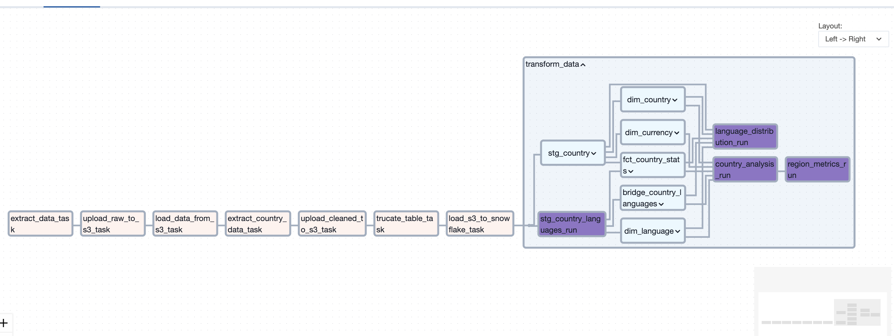
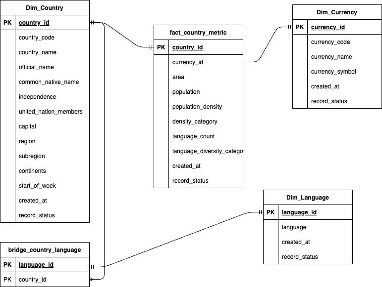
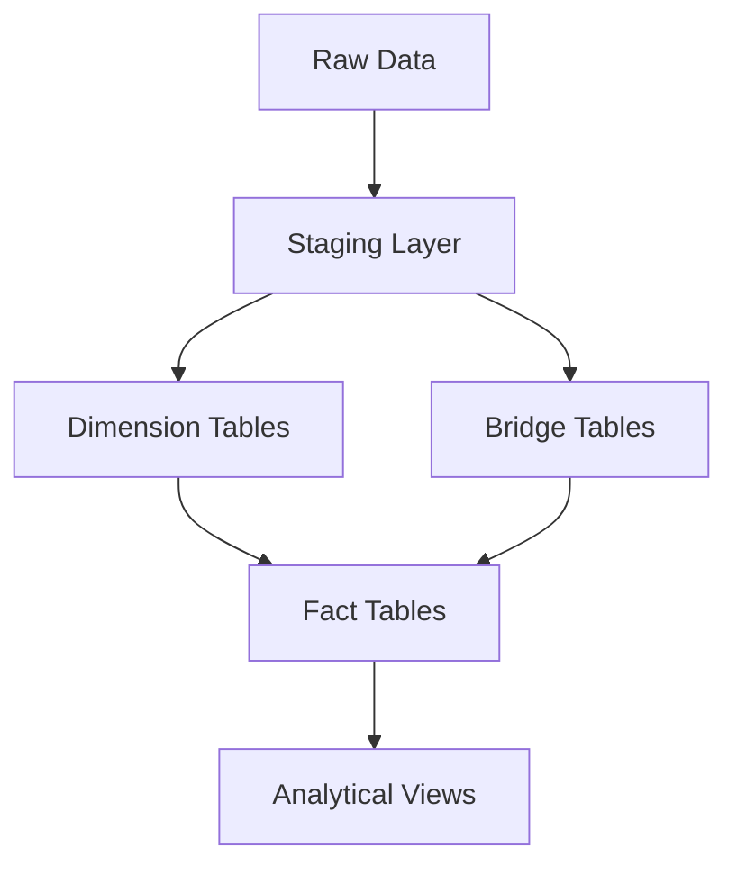
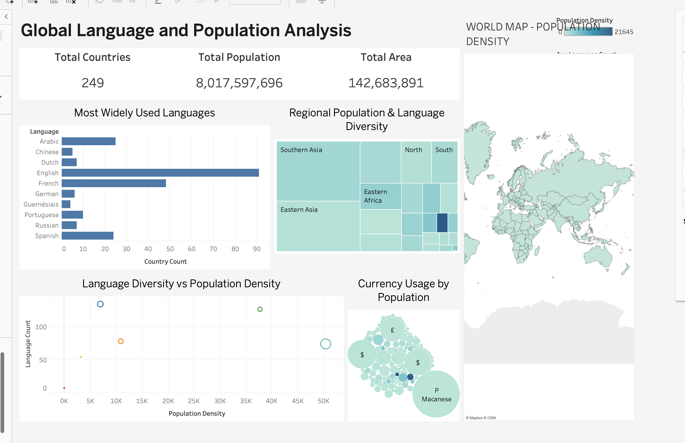

# CDE-Capstone-Project


## Background Story

A travel Agency reached out to CDE, their business model involves recommending tourist location to their customers based on different data points, they want one of our graduates to build a Data Platform that will process the data from the Country rest API [HERE](https://restcountries.com/v3.1/all) into their cloud based Database/Data Warehouse for predictive analytics by their Data Science team.

## Overview

This project implements a data platform for a travel agency to process and analyze country data for tourist location recommendations. The platform extracts data from the Country REST API, stores it in a cloud-based data lake, and transforms it for predictive analytics.

## Architecture

## Key Components

- Data Ingestion: REST API data extraction

- Storage Layers:

    - Raw Layer: Cloud Object Storage (JSON format)
    - Processed Layer: Cloud Object Storage (Parquet format)

- Orchestration: Apache Airflow
- Data Transformation: dbt
- Infrastructure: Terraform
- CI/CD: GitHub Actions


## Features

- Full API data extraction and storage in Parquet format
- Processed data attributes include:

    - Country information (name, official name, native name)
    - Geographic details (capital, region, subregion, area)
    - Demographic data (population, languages)
    - Economic indicators (currency details)
    - Administrative data (UN membership, independence status)

- Automated workflow orchestration
- Infrastructure as Code (IaC)
- Automated testing and deployment
- Data modeling (Fact and Dimension tables)

## Choice of Tools

- Cloud Infrastructure (AWS)

    - Amazon S3: Serves as our data lake for storing raw data in Parquet format, offering durability, scalability, and cost-effectiveness for large-scale data storage.
    - Amazon ECR: Hosts our Docker containers, providing a secure and scalable container registry that integrates seamlessly with other AWS services.

- Data Warehouse (Snowflake)

    - Selected for its ability to handle large-scale data processing, separation of storage and compute resources, and native support for semi-structured data.
Offers excellent integration with dbt for data transformation and modeling.

- Data Transformation (dbt)

    - Implements data transformation logic using SQL, enabling version control of data transformations.
Provides documentation, testing, and lineage tracking capabilities.
Creates modular and reusable transformation code through its macro system.

- Orchestration (Apache Airflow)

    - Manages complex data pipeline dependencies and scheduling.
    - Provides robust monitoring, logging, and error handling capabilities.
    - Offers extensive integration with AWS services and other tools in our stack.

- Containerization (Docker)

    - Ensures consistent development and deployment environments.
    - Packages application code and dependencies into portable containers.
    - Simplifies deployment and scaling of applications across different environments.

- Version Control & CI/CD (GitHub & GitHub Actions)

    - GitHub: Maintains code version control and collaboration.
    - GitHub Actions: Automates testing, building, and deployment processes.
    - Implements automated code quality checks and container image builds.

- Data Visualization (Tableau)

    - Creates interactive dashboards for data analysis.
    - Connects directly to Snowflake for real-time data visualization.
    - Provides easy-to-use interface for business users to explore data.

## Project Dependencies

This project utilizes several Python packages and modules, each serving a specific purpose in the data pipeline and development workflow:

### Data Pipeline Modules

#### Apache Airflow Related

- apache-airflow-providers-snowflake
    - Provides native integration between Apache Airflow and Snowflake
    - Enables direct execution of Snowflake queries from Airflow DAGs
    - Includes pre-built operators and hooks for Snowflake operations
    - Manages Snowflake connections securely

- astronomer-cosmos
    - Integrates dbt with Apache Airflow
    - Provides dbt-specific operators for Airflow
    - Enables automated testing and documentation of dbt models
    - Manages dbt project dependencies within Airflow

#### Data Processing and Storage

- boto3
    - AWS SDK for Python
    - Manages interactions with AWS services (S3, ECR)
    - Handles file uploads/downloads to/from S3
    - Manages AWS authentication and session handling

- dbt-snowflake
    - Connects dbt core with Snowflake
    - Enables data transformation in Snowflake
    - Manages Snowflake-specific compilation of SQL
    - Handles incremental models and snapshots

### Development and Code Quality Tools

#### Code Formatting and Style

- black

    - Enforces consistent Python code formatting
    - Automatically formats code to meet PEP 8 standards
    - Eliminates debates about code style
    - Maintains consistent code appearance across the project


- flake8

    - Lints Python code for potential errors
    - Checks for style guide violations
    - Identifies complexity issues
    - Ensures code quality standards


- isort

    - Automatically sorts Python imports
    - Organizes imports into sections (standard library, third-party, local)
    - Maintains consistent import ordering
    - Improves code readability

## Data Dictionary - Country Dataset

| Column Name | Data Type | Description | Example | Notes |
|------------|-----------|-------------|---------|-------|
| Country_Name | String | Common name of the country used internationally | "France" | This is the generally recognized name of the country in English |
| independence | Boolean | Indicates if the country is independent | true/false | NULL values may indicate disputed status |
| united_nation_members | Boolean | Indicates if the country is a UN member | true/false | Represents official UN membership status |
| start_of_week | String | The day when the week starts in this country | "monday" | Usually in lowercase; common values: monday, sunday |
| official_name | String | The official full name of the country | "French Republic" | Used in formal/diplomatic contexts |
| common_native_name | String | The country's name in its primary local language | "France" | Extracted from the first available native name |
| currency_code | String | Three-letter currency code | "EUR" | Follows ISO 4217 standard; may be empty for countries using multiple currencies |
| currency_name | String | Full name of the primary currency | "Euro" | The official name of the currency in English |
| currency_symbol | String | Symbol used to represent the currency | "€" | May be empty or contain UTF-8 characters |
| country_code | String | International dialing code | "+33" | Includes the '+' prefix and country code |
| capital | String | Name of the primary capital city | "Paris" | May be empty for disputed territories or countries with multiple capitals |
| region | String | Geographic region of the country | "Europe" | Broad geographic classification |
| subregion | String | More specific geographic subdivision | "Western Europe" | May be empty for some countries |
| languages | String | Comma-separated list of official languages | "French, Occitan" | Multiple languages are separated by commas |
| area | Float | Total area in square kilometers | 551695 | Includes both land and water area where applicable |
| population | Integer | Total population count | 67391582 | Based on most recent available data |
| continents | String | Comma-separated list of continents | "Europe" | Some countries may span multiple continents |

### Additional Notes:

1. **Missing Values**:
   - Empty strings ("") are used for text fields where data is not available
   - NULL values may appear in boolean fields (independence, united_nation_members)
   - Numeric fields (area, population) may contain NULL for disputed territories

2. **Data Updates**:
   - Population data may vary based on the most recent census or estimates
   - Political information (UN membership, independence) reflects current status at time of extraction

3. **Multiple Values**:
   - Languages and continents fields may contain multiple values separated by commas
   - Currency information represents the primary or most commonly used currency when multiple exist

4. **Standardization**:
   - Country names follow standard English naming conventions
   - Currency codes follow ISO 4217
   - Region and subregion classifications follow UN M49 standard

5. **Special Cases**:
   - Disputed territories may have incomplete information
   - Dependencies and special administrative regions may have unique patterns in certain fields
   - Some countries may have multiple capitals or no fixed capital

## Script Overview

#### `extract.py`
This script handles the initial data extraction from the REST Countries API and includes logging functionality.

Key features:

- Configurable retry mechanism (max 3 retries with 5-second delays)
- Comprehensive logging system
- Data fetching from REST API
- JSON file storage with timestamps

Main functions:

- log(message): Handles logging with timestamps
- extract_data(url): Fetches data from the API and saves it as a JSON file

#### `upload_to_s3.py`

Manages the upload of data files to AWS S3 storage.

Key features:

- AWS credentials management via config file
- Error handling for S3 uploads
- Flexible object naming

Main function:

- upload_to_s3(json_path, bucket_name, object_name): Uploads files to specified S3 bucket

#### `download.py`

Handles data transformation and processing operations:
Key features:

- S3 data retrieval
- Country data extraction and transformation
- Parquet file generation

Main functions:

- get_json_data_from_s3(bucket_name, object_s3_path): Retrieves JSON data from S3
- extract_country_data(json_data): Transforms raw country data into structured format

Extracted data includes:

- Country names (common and official)
- Independence status
- UN membership
- Currency information
- Geographic data
- Population statistics
- Language information

#### `main.py`

Contains Airflow task definitions and orchestration logic:
Key functions:

- run_extraction(): Initiates data extraction
- run_upload_raw_to_s3(): Handles raw data upload to S3
- run_load_data_from_s3(): Manages data retrieval from S3
- run_extract_country_data(): Processes country data
- truncate_snowflake_table(): Prepares Snowflake table for new data
- load_s3_to_snowflake(): Loads processed data into Snowflake

Data Flow

1. Extract data from REST Countries API
2. Save raw JSON data locally
3. Upload raw data to S3
4. Process and transform data
5. Save cleaned data as Parquet
6. Upload cleaned data to S3
7. Load data into Snowflake

## Countries Data Pipeline DAG

This document describes the Apache Airflow DAG that orchestrates the countries data pipeline, including ETL processes and dbt transformations.

### DAG Overview

- **DAG ID**: `countries_dag`
- **Schedule**: Monthly (runs on the 1st day of each month at midnight)
- **Start Date**: June 21, 2024
- **Owner**: Chidera
- **Retry Configuration**: 2 retries with 3-second delays

### Default Configuration

```python
default_args = {
    "owner": "Chidera",
    "email": "chideraozigbo@gmail.com",
    "email_on_failure": False,
    "email_on_retry": False,
    "retries": 2,
    "retry_delay": timedelta(seconds=3),
}
```

### DBT Configuration

The DAG integrates with dbt using the following configurations:

```python
DBT_PROJECT_PATH = f"{os.environ['AIRFLOW_HOME']}/dags/dbt/countries_dbt"
DBT_EXECUTABLE_PATH = f"{os.environ['AIRFLOW_HOME']}/dbt_venv/bin/dbt"
```

### Snowflake Profile Configuration
```python
profile_config = ProfileConfig(
    profile_name="default",
    target_name="dev",
    profile_mapping=SnowflakeUserPasswordProfileMapping(
        conn_id="snowflake_default1",
        profile_args={
            "database": "country_database",
            "schema": "raw_country_schema",
        },
    ),
)
```

### Task Sequence

1. **extract_data_task**
   - Fetches data from the REST Countries API
   - Creates initial JSON file

2. **upload_raw_to_s3_task**
   - Uploads raw JSON data to S3 bucket
   - Stores in 'raw' folder

3. **load_data_from_s3_task**
   - Retrieves JSON data from S3
   - Prepares for transformation

4. **extract_country_data_task**
   - Transforms raw country data
   - Creates structured Parquet file

5. **upload_cleaned_to_s3_task**
   - Uploads transformed Parquet file to S3
   - Stores in 'cleaned' folder

6. **trucate_table_task**
   - Clears the target Snowflake table
   - Prepares for new data load

7. **load_s3_to_snowflake_task**
   - Loads Parquet data into Snowflake
   - Uses COPY INTO command

8. **transform_data (DBT TaskGroup)**
   - Executes dbt transformations
   - Applies business logic and creates models

## DAG Visualization



The DAG follows a linear execution path:
```
extract_task >> raw_upload_task >> raw_load_task >> extract_country_data_task >> cleaned_upload_task >> truncate_table_task >> load_snowflake_task >> dbt_tg
```

### Error Handling

- Tasks are configured with 2 retries
- 3-second delay between retry attempts
- Email notifications can be enabled for failures
- Each task includes comprehensive logging

### Dependencies

- Apache Airflow
- cosmos-airflow-provider
- dbt Core
- Snowflake Provider for Airflow
- Python 3.x

### Environment Requirements

1. Airflow Connections:
   - `snowflake_default1`: Snowflake connection details
   - AWS credentials configured in Airflow

2. Environment Variables:
   - `AIRFLOW_HOME`: Base Airflow directory
   - DBT virtual environment path

### Monitoring and Maintenance

- DAG runs can be monitored through Airflow UI
- Logs are available for each task
- Task duration and success rates are tracked
- Data quality checks are implemented in dbt transformations

## GitHub Actions Workflows

This repository contains two GitHub Actions workflows for code quality control and deployment automation.

### 1. Code Linting Workflow

**File:** `.github/workflows/code-linting.yml`

### Overview
This workflow performs automated code quality checks using Python linting tools.

### Trigger Events
- Push to `main` or `master` branches
- Pull requests to `main` or `master` branches

### Environment
- **Runner:** Ubuntu Latest
- **Python Version:** 3.11.5

### Steps
1. **Checkout Repository**
   - Uses: `actions/checkout@v4`
   - Purpose: Fetches repository code

2. **Python Setup**
   - Uses: `actions/setup-python@v4`
   - Configuration: Python 3.11.5

3. **Dependencies Installation**
   - Installs:
     - flake8 (linting)
     - isort (import sorting)

4. **Import Sorting Check**
   - Tool: isort
   - Checks: `scripts` directory
   - Flags:
     - `--check`: Verification mode
     - `--diff`: Shows differences

5. **Flake8 Linting**
   - Directories checked: `scripts` and `dags`
   - First pass:
     - Checks for critical errors (E9, F63, F7, F82)
     - Shows source code for violations
     - Displays statistics
   - Second pass:
     - Max complexity: 10
     - Max line length: 79 characters
     - Non-blocking (exit-zero)

## 2. Amazon ECR Deployment Workflow

**File:** `.github/workflows/ecr-deploy.yml`

### Overview
Automates the building and deployment of Docker images to Amazon Elastic Container Registry (ECR).

### Trigger Events
- Push to `main` or `master` branches
- Pull requests to `main` or `master` branches

### Environment Variables
- **AWS_REGION:** eu-north-1
- **ECR_REPOSITORY:** cde-project

### Permissions
- **contents:** read

### Steps
1. **Repository Checkout**
   - Uses: `actions/checkout@v4`
   - Purpose: Fetches repository code

2. **Version Generation**
   - Format: `1.${GITHUB_RUN_NUMBER}`
   - Output: Stored in `version` output variable
   - Example: 1.123 (where 123 is the run number)

3. **AWS Credentials Configuration**
   - Uses: `aws-actions/configure-aws-credentials@v4`
   - Required Secrets:
     - `AWS_ACCESS_KEY_ID`
     - `AWS_SECRET_ACCESS_KEY`
   - Region: Set from environment variable

4. **ECR Login**
   - Uses: `aws-actions/amazon-ecr-login@v2`
   - Purpose: Authenticates with Amazon ECR

5. **Docker Build and Push**
   - Actions:
     - Builds Docker image
     - Tags with version number
     - Pushes to ECR repository
   - Tag format: `<registry>/<repository>:<version>`

### Required Secrets

The following secrets need to be configured in your GitHub repository:

- `AWS_ACCESS_KEY_ID`: AWS access key for ECR access
- `AWS_SECRET_ACCESS_KEY`: AWS secret key for ECR access

### Version Control Strategy

- ECR images are tagged with an automatically incremented version number
- Version format: `1.X` where X is the GitHub Actions run number
- Each successful deployment creates a new version

### Best Practices Implemented

1. **Code Quality**
   - Automated import sorting
   - Style guide enforcement
   - Complexity checks
   - Line length restrictions

2. **Security**
   - Minimal permissions model
   - Secure secrets handling
   - Latest action versions used

3. **Versioning**
   - Automated version generation
   - Unique version for each deployment
   - Traceable build numbers

4. **CI/CD**
   - Automated testing on PR
   - Automated deployment on merge
   - Consistent build environment

### Error Handling

- Linting errors are displayed with source code context
- Build failures prevent deployment
- Non-critical style issues don't block the pipeline

### Workflow Dependencies

1. **Code Linting:**
   - Python 3.11.5
   - flake8
   - isort

2. **ECR Deployment:**
   - Docker
   - AWS CLI
   - ECR repository access


## DBT Project Documentation


### Project Overview
This DBT project transforms raw country demographic data into a structured dimensional model for analyzing global language distribution, population metrics, and currency usage patterns.

## Data Model

### Entity Relationship Diagram



### Layer Overview

### Source Layer (Raw Data)
- **country_data**: Raw country demographic information
  - Contains base country attributes, languages, and currency information

### Staging Layer
1. **stg_country**
   - Cleanses and standardizes raw country data
   - Generates business keys for country identification
   - Basic data type conversions and trimming

2. **stg_country_languages**
   - Flattens the comma-separated languages string into individual records
   - Standardizes language names

### Dimension & Bridge Layer
1. **dim_country**
   - Core country dimension with descriptive attributes
   - Includes geographical and political information

2. **dim_language**
   - Language dimension with surrogate keys
   - Tracks unique languages across countries

3. **dim_currency**
   - Currency dimension with surrogate keys
   - Contains currency codes, names, and symbols

4. **bridge_country_languages**
   - Many-to-many relationship between countries and languages
   - Deduplicates language associations

### Fact Layer
**fact_country_metric**
- Contains measurable metrics about countries
- Calculated fields:
  - Population density
  - Language count
  - Density categorization
  - Language diversity classification

### Analytical Layer
1. **language_by_country_analysis**
   - Aggregates language distribution statistics
   - Calculates population coverage by language

2. **population_language_analysis**
   - Combines demographic and linguistic metrics
   - Regional analysis of language diversity


### Dimension Models

#### dim_country
- **Purpose**: Core country dimension table
- **Key Fields**: country_id, country_code, country_name
- **SCD Type**: Type 0 (No history tracking)

#### dim_language
- **Purpose**: Language dimension table
- **Key Fields**: language_id, language
- **Notes**: Uses surrogate keys for language identification

#### dim_currency
- **Purpose**: Currency dimension table
- **Key Fields**: currency_id, currency_code
- **Notes**: Unique currency attributes per country

### Fact Model
The fact_country_metric model incorporates:
- Population metrics
- Area calculations
- Density measurements
- Language diversity metrics
- Currency relationships

### Data Quality & Testing
The source data is validated through multiple test cases defined in the schema.yml:

- Mandatory fields validation for country names and codes
- Uniqueness constraints on country identifiers
- Standard format checks for currency and country codes
- Data completeness verification

### Custom Macros
The project includes utility macros for:

- Business key generation using surrogate keys
- Data transformation functions
- Testing helpers

## Data Flow Diagram


## Usage Guidelines
1. Run full refresh for dimension tables:
```bash
dbt run --full-refresh --select dim_*
```

2. Incremental updates for facts:
```bash
dbt run --select fact_country_metric
```

3. Generate documentation:
```bash
dbt docs generate
dbt docs serve
```

## Data Findings
*Analysis of worldwide language distribution and demographic patterns*


## Overview
This analysis explores the relationship between global language distribution, population density, and regional diversity based on data collected from our global demographics API. The analysis provides insights into language prevalence, population distribution, and currency usage across different regions.

## Key Metrics
- **Total Countries Analyzed**: 249
- **Global Population**: 8,017,597,696
- **Total Area Covered**: 142,683,891 (units)

## Language Distribution
### Most Widely Used Languages
1. English (dominant presence in ~90 countries)
2. French (~45 countries)
3. Arabic (~20 countries)
4. Spanish (~15 countries)
5. Other notable languages:
   - Chinese
   - Dutch
   - German
   - Portuguese
   - Russian
   - Guernésiais

*Note: The numbers represent the country count where each language is officially recognized or commonly used.*

## Regional Analysis
The dashboard reveals distinct patterns in regional population and language diversity:
- **Southern Asia**: Highest population density with significant language diversity
- **Eastern Asia**: Large population centers with relatively uniform language distribution
- **Eastern Africa**: Moderate population density with high language diversity
- **North/South Regions**: Lower population density with varying language patterns

## Population Density Patterns
The Language Diversity vs Population Density scatter plot shows:
- Highest language diversity occurs in regions with population densities between 5K-10K
- Some outliers show high language counts (>100) in moderately populated areas
- Dense population centers don't necessarily correlate with higher language diversity

## Currency Usage
Notable patterns in currency distribution:
- Dollar ($) prevalence in multiple regions
- Pound (£) concentration in specific areas
- Macanese currency showing significant presence in its region

## Dashboard Access
To view the interactive dashboard, visit:
[Global Language and Population Dashboard](https://public.tableau.com/views/Book2_17318627897610/Dashboard1?:language=en-US&publish=yes&:sid=&:redirect=auth&:display_count=n&:origin=viz_share_link)

## Dashboard Screenshot


## Methodology
The analysis is based on data visualized through Tableau, incorporating:
- Population density metrics
- Language distribution counts
- Regional demographic patterns
- Currency usage statistics

## Conclusions
1. English remains the most widely distributed language across countries
2. Population density doesn't directly correlate with language diversity
3. Regional patterns show distinct clusters of language and currency usage
4. Southern Asia demonstrates the highest combination of population density and language diversity

---
*Last Updated: November 17, 2024*
